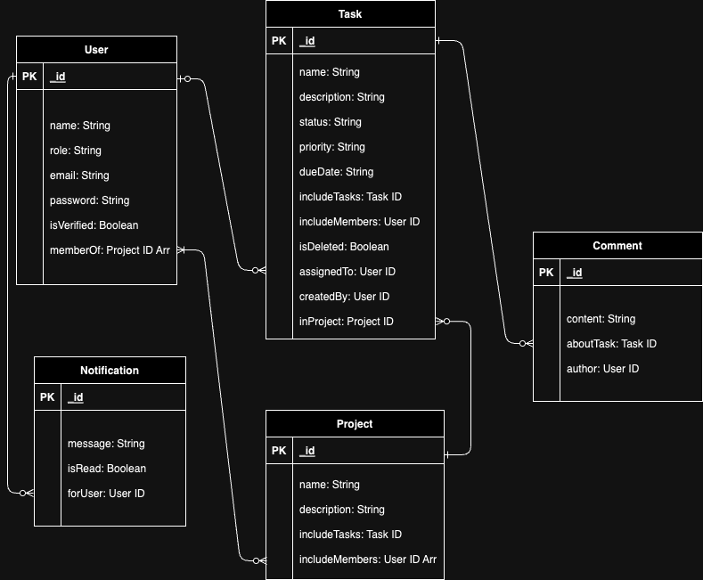

# tasuku-project-be

The server for Tasuku, a task management app

## Installation

### Install modules

```javascript
npm i
```

### For development

```javascript
npm run dev
```

## API endpoints

### Auth APIs

```javascript
/**
 * @route POST /auth/login
 * @description login with email and password
 * @body {email, password}
 * @access Public
 */
```

```javascript
/**
 * @route POST /auth/refresh
 * @description
 * @body
 * @access private
 */
```

```javascript
/**
 * @route DELETE /auth/logout
 * @description log out of account
 * @body
 * @access Public
 */
```

### User APIs

```javascript
/**
 * @route POST api/users
 * @description Create a new user
 * @access private, manager
 * @body {name, email, password}
 */
```

```javascript
/**
 * @route GET api/users
 * @description Get a list of all users
 * @access private, manager
 */
```

```javascript
/**
 * @route POST api/users/me/change_password
 * @description Change password of current user
 * @body {currentPassword, newPassword}
 * @access private
 */
```

```javascript
/**
 * @route GET api/users
 * @description Get a list of users by project
 * @access private
 */
```

### Task APIs

```javascript
/**
 * @route GET api/tasks
 * @description Get a list tasks in a project
 * @access private
 */
```

```javascript
/**
 * @route GET api/tasks/:id
 * @description Get a single task by id
 * @access private
 */
```

```javascript
/**
 * @route DELETE api/tasks/:id
 * @description Delete task by id
 * @access private
 */
```

```javascript
/**
 * @route PUT api/tasks/:id
 * @description Update a task
 * @body { description, status, priority, dueDate, assignedTo}
 * @access private
 */
```

### Project APIs

```javascript
/**
 * @route GET api/projects
 * @description Get a list of all projects
 * @access private
 */
```

```javascript
/**
 * @route GET api/projects/users/:userId
 * @description Get a list of projects of which a user is a member
 * @access private
 */
```

```javascript
/**
 * @route GET api/projects/:id
 * @description Get a single project by id
 * @access private
 */
```

```javascript
/**
 * @route PUT api/projects/:id
 * @description Update a project
 * @body {addedMemberId}
 * @access private
 */
```

### Comment APIs

```javascript
/**
 * @route POST api/comments
 * @description Create a new comment
 * @body {content}
 * @access private
 */
```

```javascript
/**
 * @route GET api/comments/tasks/:taskId
 * @description Get a list of comments about a task
 * @access private
 */
```

### Invitation APIs

```javascript
/**
 * @route POST api/invitations
 * @description create a new invitation
 * @body { email, name }
 * @access private, manager
 */
```

```javascript
/**
 * @route GET api/invitations/confirm_email
 * @description
 * @access public
 */
```

## Diagram Relation


